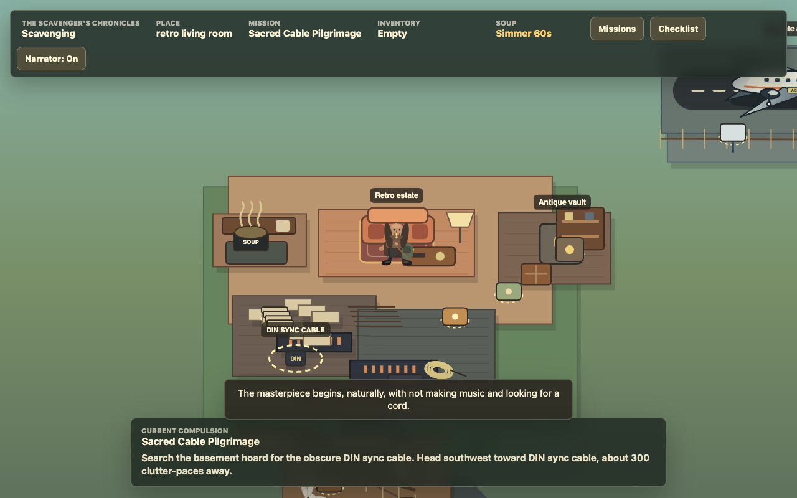
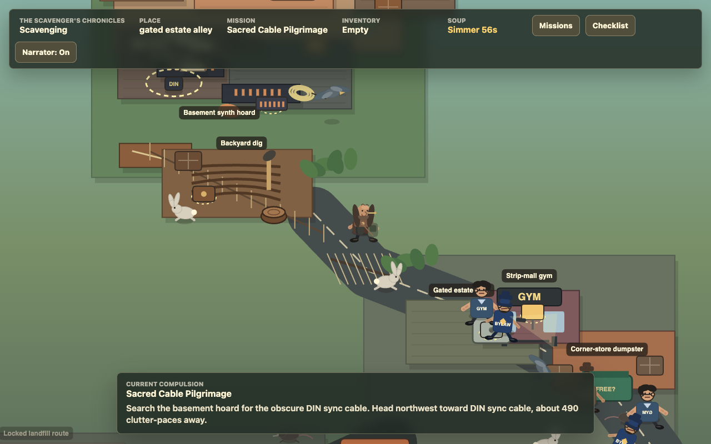

# The Scavenger's Chronicles

**Play it here:** [arnegleason.github.io/the-scavengers-chronicles](https://arnegleason.github.io/the-scavengers-chronicles/)

A short browser-playable isometric scavenging comedy about an aging obsessive in 2026 who lives like time became suspicious after he turned 14.

The Scavenger owns too many synthesizers, too many newspapers, too many antique things, and not nearly enough of the exact cables he insists are required before his masterpiece can begin. He scavenges alleys, backyards, landfills, old factories, and private airfields for junk he believes will become furniture, audio gear, art, or finally the missing piece of the song he has avoided composing for forty years.





## Scenario

It is 2026. The house is a preserved retro estate where the 1950s never fully left, the basement became a synth-and-newspaper weather system, and every object might become essential if The Scavenger can invent a future project around it.

The game is deliberately small: a playable slice of hoarder logic, cable obsession, salvage romance, soup emergencies, and unfinished-masterpiece avoidance.

## Controls

- `WASD` / arrow keys: move.
- `E`, `Space`, or `Enter`: interact, pick up, inspect, deliver, or dismiss the mission browser.
- `M`: open the mission browser.
- `C`: open the optional checklist.
- `R`: drop the selected inventory item.
- `F`: use the selected inventory item.
- `1` / `2` / `3` / `4`: select an inventory slot.
- `Shift`: shuffle faster, with the confidence of a man late for a dumpster.
- `END` on the intro screen: jump straight to the ending animation for testing.

## What Is In The Prototype

- A scrolling intro, five main scavenging errands, and a short ending animation.
- A flat isometric world with the estate, basement hoard, backyard, alley, abandoned lot, dumpster route, landfill, factory, and airfield.
- Four-slot inventory with pickup, drop, re-pick, selected item use, and mission delivery.
- A mission browser, optional checklist, guidance dock, target markers, and increasingly impatient navigation nudges.
- A recurring soup timer that interrupts everything because documentation of the soup is apparently important.
- Browser speech-synthesis narration, procedural gag sounds, and small ambient NPC bits.
- Rabbits, birds, rats, gym guys, bylaw patrols, Gary the Rummager, and Big Wanda, all drawn directly in canvas.

## How It Was Built

This started as a side-spawn from the Whiskey Runner Rob canvas pattern and became its own tiny static web game. There is no engine, bundler, package install, or asset pipeline: just hand-authored HTML, CSS, and JavaScript.

The game loop, world state, mission system, drawing code, audio cues, NPC behavior, and ending animation all live in `web/app.js`. The visuals are generated with Canvas 2D calls: isometric ground shapes, props, labels, characters, UI prompts, procedural movement, and the final-frame illustration are all vector-style drawing functions.

The character art uses a simple cutout construction approach: separate heads, torsos, limbs, shoes, hair, bags, and props, with subtle fill differences instead of heavy outlines. That keeps the figures easy to animate while still looking handmade and specific.

## Hobby Stats

- `1` static page entrypoint and `0` build steps.
- About `5,399` lines of JavaScript, `650` lines of CSS, and `156` lines of HTML.
- `5` main missions, `10` optional checklist discoveries, `4` inventory slots, and `1` soup emergency that refuses to respect pacing.
- `242` JavaScript functions, including world drawing helpers, NPC renderers, mission logic, procedural audio, and the ending scene.
- Current repo size is about `1.9 MB`, including screenshots.

## Run Locally

Open [web/index.html](web/index.html) in a browser.

Or serve the repo root:

```bash
python3 -m http.server 8000
```

Then visit [http://localhost:8000/web/](http://localhost:8000/web/).

## Project Notes

The living world and mechanics bible is in [GAME_BIBLE.md](GAME_BIBLE.md).

Version history is tracked in [CHANGELOG.md](CHANGELOG.md).
