# The Scavenger's Chronicles

**Play it here:** [arnegleason.github.io/the-scavengers-chronicles](https://arnegleason.github.io/the-scavengers-chronicles/) · the original 2D version is still at [/classic/](https://arnegleason.github.io/the-scavengers-chronicles/classic/)

A short, ridiculously slapstick browser comedy about Bill, an aging obsessive in 2026 whose taste stopped in 1986. He lives in his late mother's 1955 house, now a hoarder shambles he calls an archive. He has been preparing his synth masterpiece for forty years, and it can't begin until he finds the exact cable. And an adapter. And a stump with personality. And the soup comes first.

> **A redo, five months on.** I made the original 2D version of this game in a couple of days in May 2026. At the end of September I tried a quick redo, porting it into comic-book 3D, mostly to see how much better it could be done now. Not that much time had passed, but the models have come a long way. This time they came up with the designs and the 3D motion themselves (Bill, the house, the walk, the pratfalls, the camera) instead of me having to spell each one out as its own separate task. [Then and now](#then-and-now) compares the two.

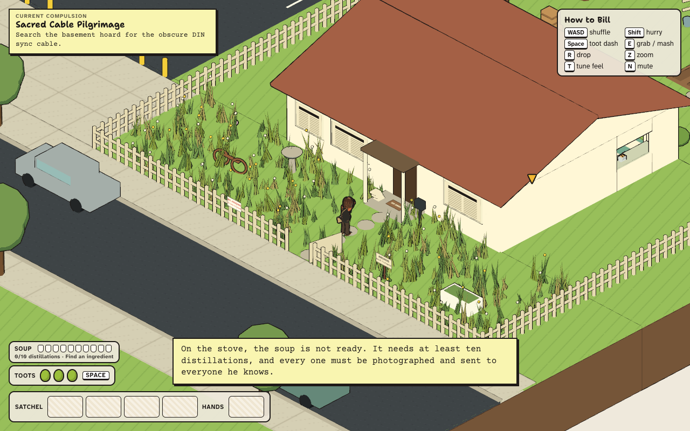

<table>
  <tr>
    <td width="50%">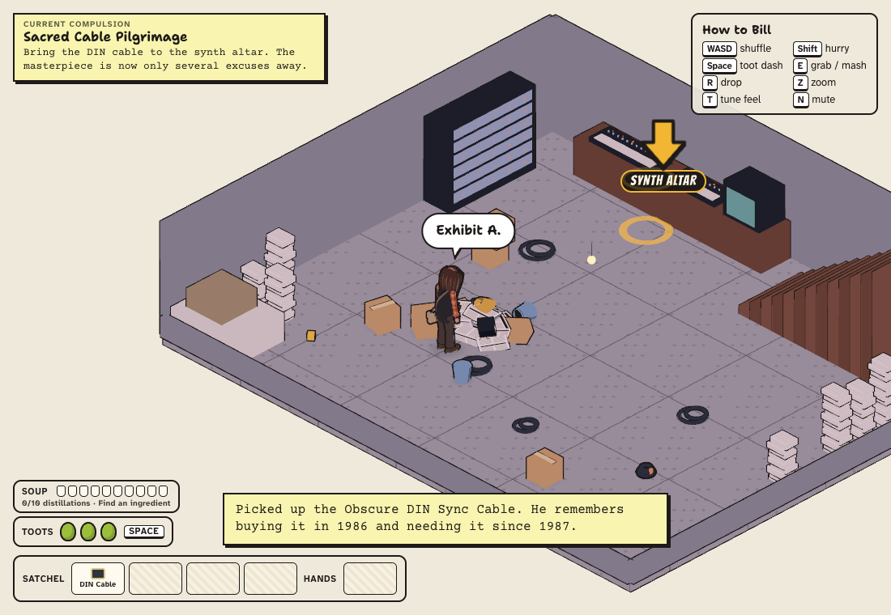<br><sub><b>The Sacred Cable Pilgrimage.</b> The DIN cable is in the basement hoard. Mash E to dig.</sub></td>
    <td width="50%">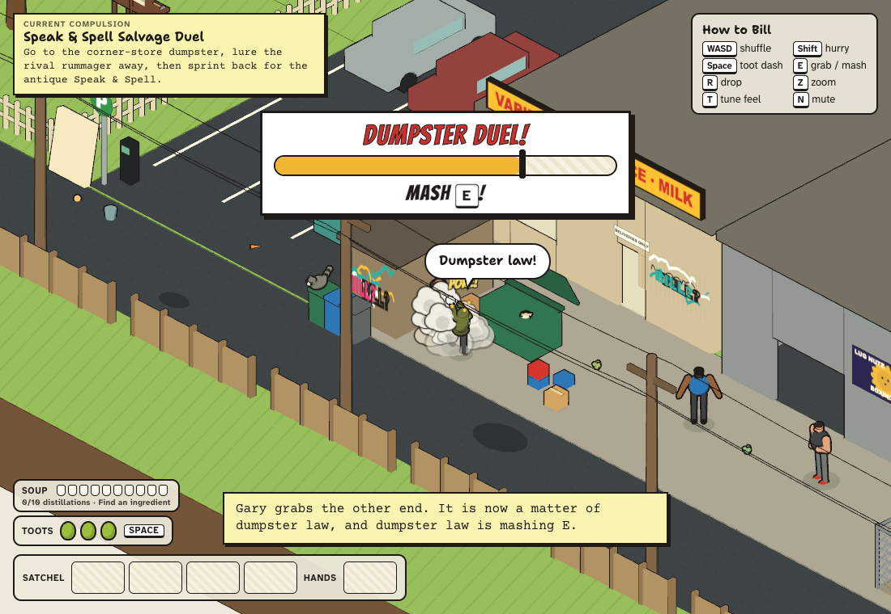<br><sub><b>The Dumpster Duel.</b> Gary the rummager also wants the Speak & Spell. It's a cat fight.</sub></td>
  </tr>
  <tr>
    <td>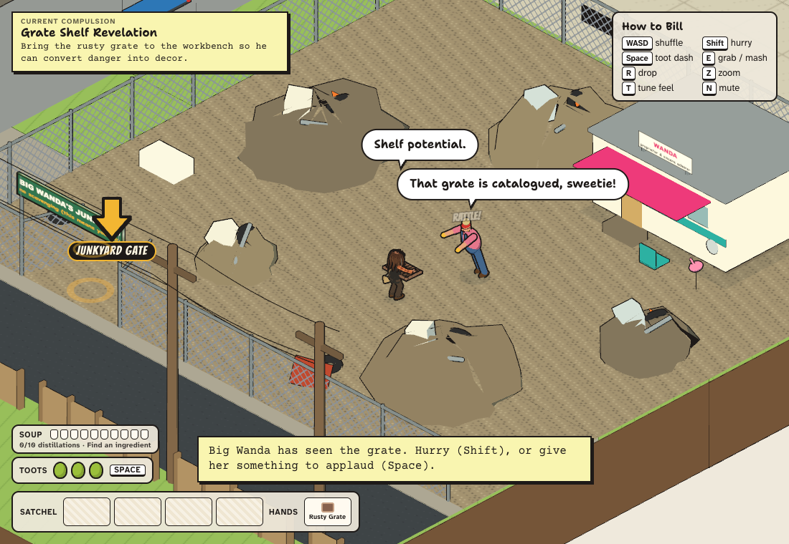<br><sub><b>Big Wanda's Junkyard.</b> She admires him until he takes the grate. Then she lunges.</sub></td>
    <td>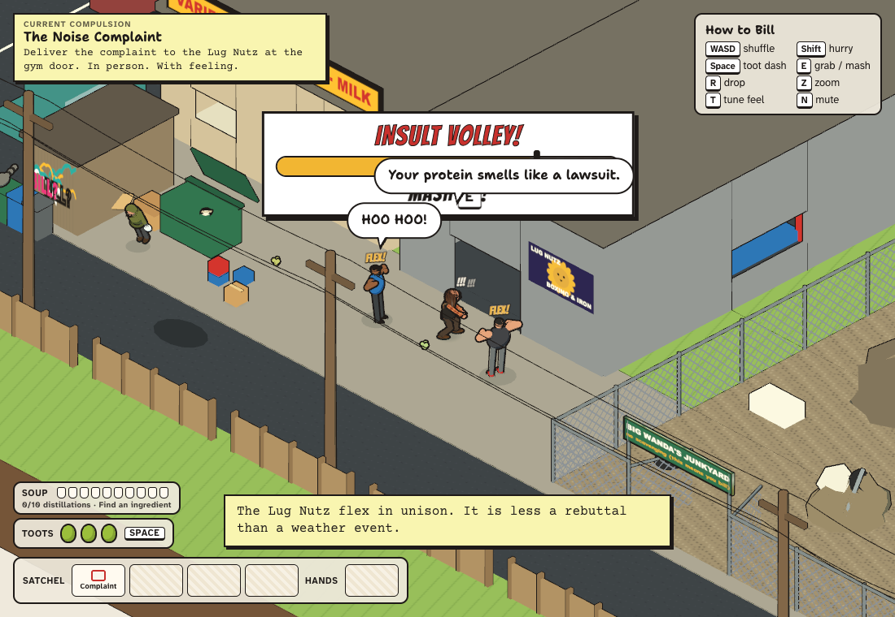<br><sub><b>The Noise Complaint.</b> Typed at Bill's Legal Department, read to the Lug Nutz. They flex.</sub></td>
  </tr>
  <tr>
    <td>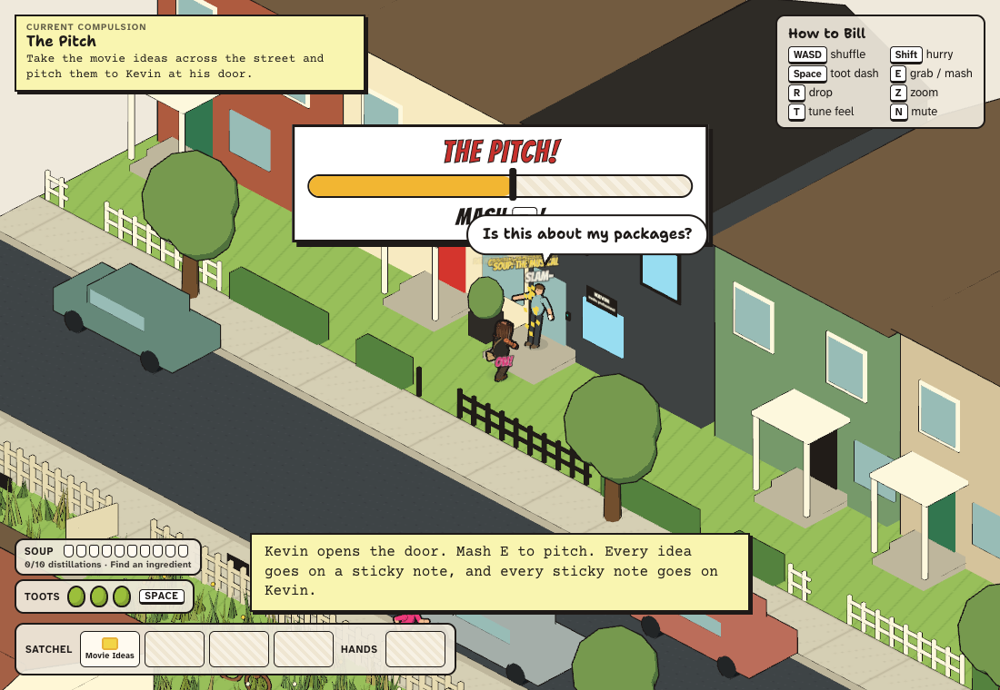<br><sub><b>The Pitch.</b> Kevin works in media, so every movie idea goes on a sticky note, and every sticky note goes on Kevin.</sub></td>
    <td>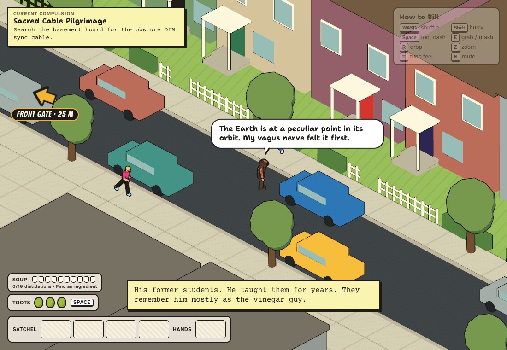<br><sub><b>The street spins.</b> When the camera swings round, Bill falls over, then blames his vagus nerve.</sub></td>
  </tr>
  <tr>
    <td>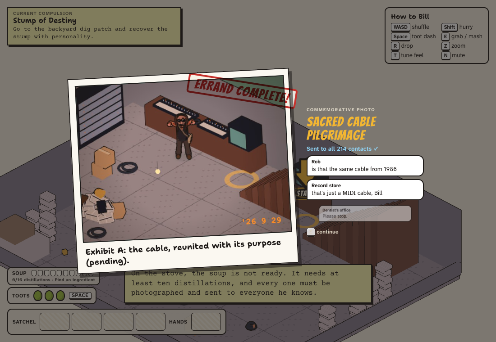<br><sub><b>Every errand ends in a photo,</b> sent to all 214 of his contacts. They reply.</sub></td>
    <td>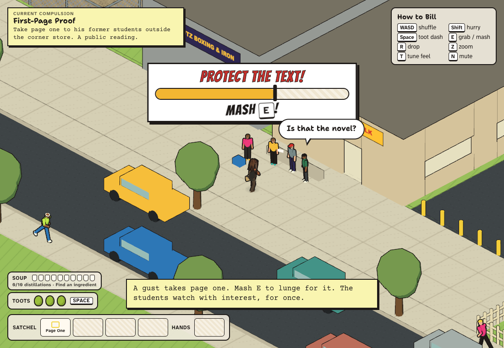<br><sub><b>First-Page Proof.</b> Page one of <i>Captain Caffeine</i>, read aloud to his former students. A gust has other plans.</sub></td>
  </tr>
</table>

## What's in it

- **Twelve errands in one guided chain,** from the Sacred Cable Pilgrimage to First-Page Proof, each with an arrow to follow, a silly mash-E challenge at the key moment, and a commemorative photo at the end. They can be done out of order.
- **Eleven action challenges:** the Hoard Dive, the Stump Wrestle, the Dumpster Duel, SHELF-IFY!, LEGAL DEPARTMENT!, the Insult Volley, THE PITCH!, LIFE LESSONS!, RESERVE TRANSFER!, CURATE! and PROTECT THE TEXT!, plus a chase through Big Wanda's Junkyard.
- **A gag every 10–15 seconds:** the toot dash, a rake, a skateboard, bird poop, a comb-over gust, a newspaper that follows him home, a toaster with a grudge, and whatever else the gag clock finds when things go quiet.
- **Soup first:** ten distillations on the stove, each one photographed and sent to everyone he knows.
- **The masterpiece:** any keyboard plays it. Two notes, then a third that always comes out wrong. He blames the gear.
- **The neighbourhood:** his house, basement and backyard, the laneway, the corner store, the Lug Nutz' boxing gym, Big Wanda's Junkyard, and the street out front. Kevin lives across the street; Bill is sure Kevin owes him, and does his pointless favours to prove it. Joggers use Bill's sidewalk (it isn't his). His former students hang around the store and remember him mostly as the vinegar guy.
- **Bill talks:** about a hundred one-liners about wherever he is, hints when you stall, and a narrator who gets snide.

### Controls

`WASD` or the arrow keys shuffle, `Shift` hurries, `Space` toot-dashes, `E` grabs (and mashes, in challenges), `R` drops. At a keyboard, `E` and `R` play notes. `Z` zooms, `N` mutes, `T` opens the feel-tuning panel.

## Then and now

<table>
  <tr>
    <td width="50%">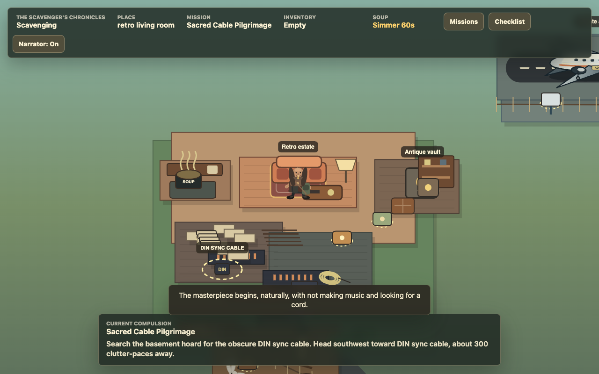</td>
    <td width="50%">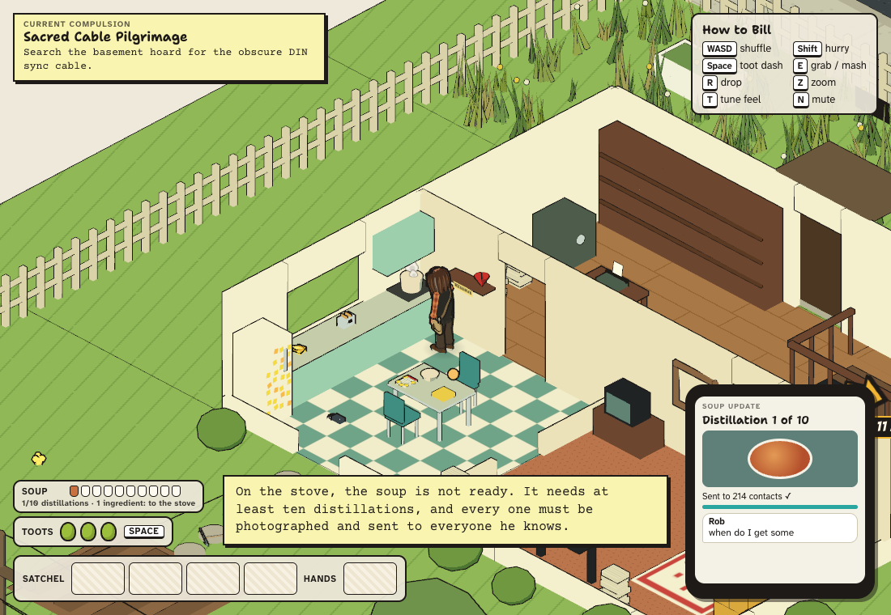</td>
  </tr>
  <tr>
    <td><sub><b>May 2026:</b> the same opening, in flat Canvas 2D</sub></td>
    <td><sub><b>September 2026:</b> the house as a comic-book dollhouse</sub></td>
  </tr>
</table>

| | The original (May 2026) | The redo (September 2026) |
|---|---|---|
| Time | 1–2 May: 6 commits | 28–30 September: about a dozen commits in 7 pull requests |
| Look | Flat Canvas 2D shapes, seen from above | Ligne-claire comic-book 3D: toon shading, ink outlines, dollhouse cutaways, a camera that turns round on the street |
| Code | About 5,400 lines of JavaScript in one file, no build step | About 10,000 lines of TypeScript in 50 modules: Three.js (WebGPU with a WebGL2 fallback), Rapier physics, Vite |
| Art and sound | Drawn with canvas calls; speech-synthesis narration | Every mesh is built in code and every sound is synthesised. There are no model, texture or audio files. |
| Content | 5 missions and a soup timer | 12 errands, 11 challenges, 10 soup distillations, 18 pointless favours for Kevin, and a cast of Gary, Big Wanda, Kevin, the Lug Nutz, four former students and the joggers |
| Testing | — | 50 unit tests, and 71 end-to-end checks that play the game in headless Chrome |
| Design | `GAME_BIBLE.md` | About 2,000 lines of design documents: art bible, Bill's character bible, comedy rules, gag catalogue, story plan |

## How the redo was built

It was built in [Claude Code](https://claude.com/claude-code) with Claude Opus 5.5, starting from the design documents in [docs/design/](docs/design/README.md). The first playable piece was a walking toy, to prove that shuffling around and carrying junk felt good before any errands existed. After that, each round added an area or a pass (slapstick, soup, the Route, the street, the neighbours, the story) from playtest feedback.

Some gags and story ideas came from brainstorms with ChatGPT, which has a long history of conversations about Bill and his friends. The briefs it was given are in [docs/design/briefs/](docs/design/briefs/), and what came back is sorted into [gags.md](docs/design/gags.md) and [story.md](docs/design/story.md).

## Run it locally

It needs Node 22 or newer.

```bash
npm install
npm run dev
```

Then open [http://localhost:5173/](http://localhost:5173/). The URL hash takes debug options, such as `#at=x,y,z` to start somewhere else or `#skip=cablePilgrimage` to skip errands.

| Command | What it does |
|---|---|
| `npm test` | Unit tests for the errand chain, Gary, Big Wanda, the challenges, the gag clock, the soup, Kevin's favours, wayfinding and more |
| `npm run typecheck` | TypeScript check |
| `node tools/e2e.mjs` | Plays the errands, challenges and gags in headless Chrome. Pass a comma-separated filter to run some of them. |
| `node tools/shots.mjs` | Screenshots of each area into `shots/` |
| `npm run build` | Static build into `dist/`. Pushing to `main` deploys it to GitHub Pages. |

## The original 2D prototype (May 2026)


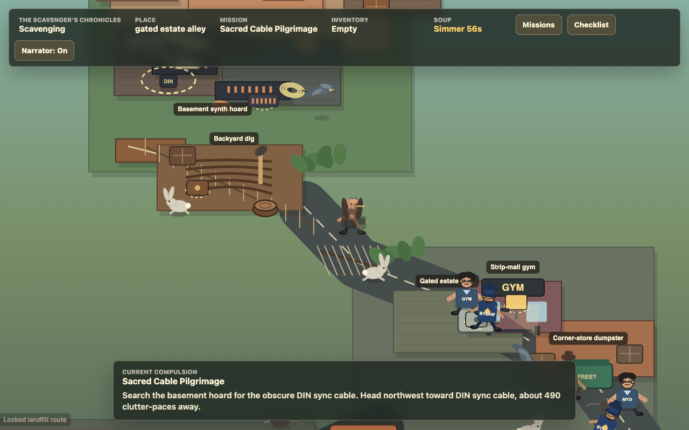

In the original, he was just The Scavenger. He scavenges alleys, backyards, landfills, old factories and private airfields for junk he believes will become furniture, audio gear, art, or finally the missing piece of the song he has avoided composing for forty years. It is deliberately small: a playable slice of hoarder logic, cable obsession, salvage romance, soup emergencies and unfinished-masterpiece avoidance.

It lives in [public/classic/](public/classic/index.html) and is served at [/classic/](https://arnegleason.github.io/the-scavengers-chronicles/classic/). To run it locally:

```bash
python3 -m http.server 8000 --directory public
```

Then visit [http://localhost:8000/classic/](http://localhost:8000/classic/).

### What's in it

- A scrolling intro, five main scavenging errands, and a short ending animation.
- A flat isometric world with the estate, basement hoard, backyard, alley, abandoned lot, dumpster route, landfill, factory, and airfield.
- Four-slot inventory with pickup, drop, re-pick, selected item use, and mission delivery.
- A mission browser, optional checklist, guidance dock, target markers, and increasingly impatient navigation nudges.
- A recurring soup timer that interrupts everything because documentation of the soup is apparently important.
- Browser speech-synthesis narration, procedural gag sounds, and small ambient NPC bits.
- Rabbits, birds, rats, gym guys, bylaw patrols, Gary the Rummager, and Big Wanda, all drawn directly in canvas.

### Controls

- `WASD` / arrow keys: move.
- `E`, `Space`, or `Enter`: interact, pick up, inspect, deliver, or dismiss the mission browser.
- `M`: open the mission browser. `C`: open the optional checklist.
- `R`: drop the selected inventory item. `F`: use it. `1` to `4`: select an inventory slot.
- `Shift`: shuffle faster, with the confidence of a man late for a dumpster.
- `END` on the intro screen: jump straight to the ending animation for testing.

### How it was built

It started as a side-spawn from the Whiskey Runner Rob canvas pattern and became its own tiny static web game. There is no engine, bundler, package install or asset pipeline: just hand-authored HTML, CSS and JavaScript. The game loop, world state, mission system, drawing code, audio cues, NPC behaviour and ending animation all live in one `app.js`. The characters use a cutout construction (separate heads, torsos, limbs, shoes, hair, bags and props, with subtle fill differences instead of heavy outlines), which keeps them easy to animate while still looking handmade.

Hobby stats: 1 static page and 0 build steps; about 5,400 lines of JavaScript, 650 of CSS and 156 of HTML; 242 functions; 5 main missions, 10 optional checklist discoveries, 4 inventory slots, and 1 soup emergency that refuses to respect pacing.

## Project notes

The living world and mechanics bible is [GAME_BIBLE.md](GAME_BIBLE.md), and the design documents are in [docs/design/](docs/design/README.md). Version history is in [CHANGELOG.md](CHANGELOG.md).
