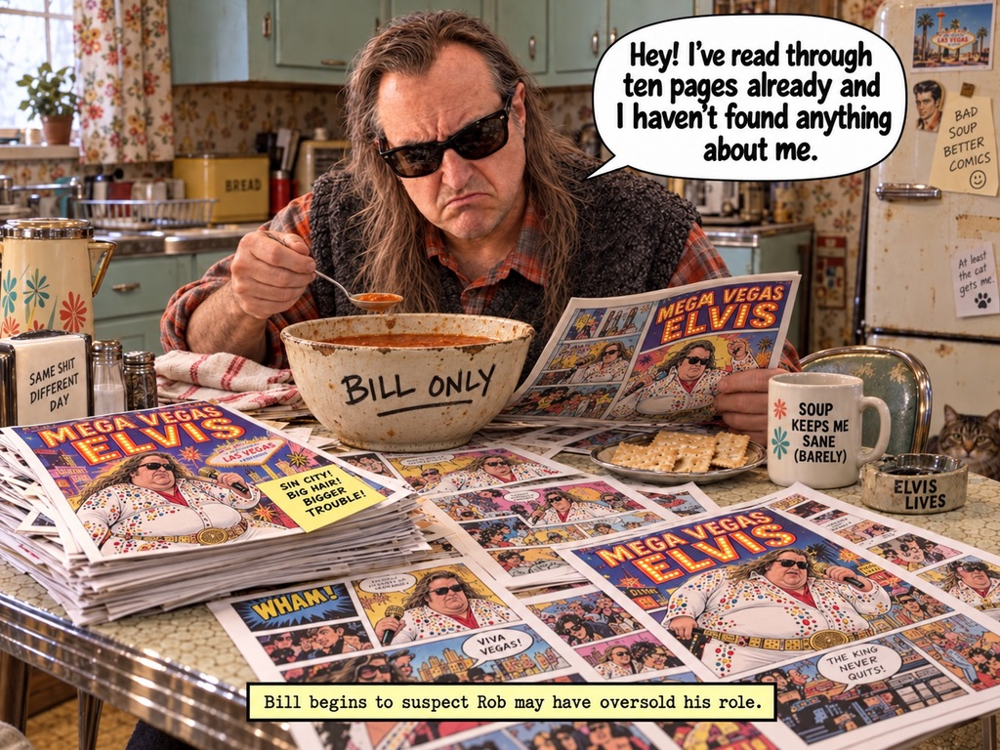

# Bill, The Scavenger

Character bible, v0. 28 September 2026.

References:

- `docs/design/reference/bill-soup-kitchen.jpg`: the primary reference for the game.
- MVE Comics, *Keith Richards: Psychic Detective* No. 1, page 6, "Bill's Legal Department": the same character in the Mega Vegas Elvis Universe (repo `keith-psychic-detective`).
- `whiskey-runner-rob/GAME_BIBLE.md`: the tone rules for Rob's circle of friends.

## Who he is

| | |
|---|---|
| Name | **Bill**. The game keeps its title, and the narrator calls him "The Scavenger" when it is being grand. Everyone else calls him Bill. |
| Age | 54 in 2026. He has been "preparing" for forty years, which freezes his taste at 14, in 1986, the year he bought the DIN sync cable. |
| Home | His late mother's preserved 1955 house. Mint cabinets, rose curtains, chrome and Formica. He changed nothing upstairs and everything in the basement. |
| Lives with | Aximandra, a tabby cat. The fridge note says "At least the cat gets me." |
| Obsessions (game) | Vintage synths, mystery cables and adapters, newspapers, antiques, wood with "tone", grates with "shelf potential". |
| Obsessions (references) | Soup (the enamel bowl marked BILL ONLY), comics (stacks of *Mega Vegas Elvis*), Elvis (an ELVIS LIVES ashtray, a photo on the fridge, a Las Vegas magnet), his unfinished novel *Captain Caffeine*, and lawsuits (a typewriter, "Bill's Legal Department"). |
| Core contradiction | He prepares forever and finishes nothing (the album, the novel), yet he is certain other people are stealing his genius. Mega Vegas Elvis has his face, and he wants $50 million for it. |
| With Rob | Rob keeps promising him a bigger part. The reference caption is canon: "Bill begins to suspect Rob may have oversold his role." |

### Tone guardrail

This follows the rule Rob's game bible sets for the whole circle of friends: crude, absurd and warm, fondly exaggerated, never mean-spirited.

- The jokes land on his **logic and obsessions**: hoarder reasoning, legal grandeur, soup priorities, cable faith.
- They never land on poverty, health, age, loneliness or his looks for their own sake.
- He gets small, absurd victories. The soup gets saved. The stump becomes furniture. The masterpiece plays, even if it is only eight bars long.

## How he talks

His voice reads like a legal letter written by a 14-year-old. He is deadpan, formal, heavy with grievance, and never embarrassed.

MVE canon, for calibration:

> "I demand $50 million in compensation. Otherwise, I shall be forced to purchase a second typewriter ribbon."

Rules:

1. **Nothing he owns is junk.** Everything is an asset, an exhibit or a future project.
2. **He escalates small matters to historic or legal stakes.** A cable is a pilgrimage; a stump is a movement.
3. **He suspects he is being left out,** especially by Rob, and sometimes by the narrator.
4. **He answers the narrator back,** rarely and only when provoked. That makes it a treat.

Proposed new lines, to sit alongside the v0.2 quips rather than replace them:

| Moment | Bill says |
|---|---|
| Picks up the DIN cable | "Exhibit A." |
| Inventory full | "My satchel is at capacity. I am consulting counsel." |
| Someone approaches the soup | "It says BILL ONLY. It's in writing. On the bowl." |
| Bylaw officer scolds him | "Noted. My legal department will be in touch." |
| The narrator gets snide | "I didn't sign off on this narrator." |
| Delivery complete | "Another step toward the masterpiece. Which is going fine." |

## How he looks

### From reference to game

| Feature | Reference | Game version (ligne claire) |
|---|---|---|
| Silhouette | Stooped over the table, hair hanging forward | The stoop is permanent: upper back curved about 15°, head pushed forward. His outline stays recognisable in solid black. |
| Hair | Long, stringy, dark brown with grey and warm highlights, well past the shoulders; thin on top with scalp showing | 8 to 12 chunky tapered clumps in two tones (base and highlight band) with a few grey streaks. Visible scalp on top with three comb-over strands. Every clump is on a spring. |
| Sunglasses | Always on, black, wayfarer-ish | Two solid black shapes, each with one white glint. **They stand in for his eyes**: expressions live in the brows and mouth. His eyes appear only when the glasses slide down his nose, which makes that the biggest reaction he has. |
| Face | Long face, heavy furrowed brow, strong nose, downturned mouth, stubble | A strong nose and a mouth that turns down by default. Stubble as a patch of Ben-Day dots on the jaw, so the print texture lives on the character. |
| Shirt | Red and rust plaid flannel, cuffs showing | Big checks in two scales, so it reads as rust-red at distance and as plaid close up. |
| Vest | Charcoal knit sweater vest | The darkest value on the body, anchoring the silhouette between the rust sleeves. Ribbing lines at the hem and armholes. |
| Legs (not in reference) | — | Proposal: dark brown corduroy trousers, and old brown loafers with worn-down heels. The bad shoes are why the shuffle scuffs. |
| Satchel (from v0.2) | — | Tan canvas messenger bag worn across the body. Cable ends poke out, and it gets lumpy as it fills. |
| Small props | Soup spoon; hairspray can (v0.2) | A spoon in his vest pocket for soup readiness. The hairspray can stays a background gag. |

### Proportions

- About **4.5 heads tall**. A caricature, not a mannequin.
- Narrow shoulders, a slight belly, **big hands** for holding junk, **big shoes** so the shuffle reads.
- In the world he is about 1.8 m tall. At the default game zoom he should be about **110 px tall on a 1080p screen**, which makes his head about 24 px and the glasses about 12 px wide.

### Two levels of read

| Level | When | What carries it |
|---|---|---|
| Game zoom | Walking around, most of play | Silhouette (hair curtains, stoop, satchel), the dark vest between rust sleeves, the two black lenses, body language and gait |
| Panel zoom | Inspect close-ups, cutscenes, the Research Log, the game-over page, the ending | Face detail: brows, mouth, stubble dots, the lens glint, and the rare eye reveal |

## Palette

v0 tokens, simplified from the reference for flat ligne claire colour. Confirm them in the Phase 0 style frames.

| Token | Hex | Notes |
|---|---|---|
| `bill.hair.base` | `#4a2e22` | Dark warm brown |
| `bill.hair.light` | `#7a5238` | Highlight band on each clump |
| `bill.hair.grey` | `#8c8076` | A few streaks only |
| `bill.skin.base` | `#d69474` | Warm, slightly ruddy |
| `bill.skin.shade` | `#a8665a` | Shadow band, tinted toward red rather than grey |
| `bill.stubble` | `#7d5a4a` | Ben-Day dots on the jaw |
| `bill.glasses` | `#141213` | Lenses and frame |
| `bill.flannel.red` | `#b5452f` | |
| `bill.flannel.rust` | `#c8703f` | |
| `bill.flannel.line` | `#3a2522` | Check lines |
| `bill.vest` | `#2b2826` | |
| `bill.vest.rib` | `#3a3633` | |
| `bill.trousers` | `#4a3b30` | |
| `bill.shoes` | `#5a3a22` | |
| `bill.satchel` | `#b99a6b` | |
| `bill.satchel.strap` | `#7d6547` | |
| `ink` | `#1e1a18` | Warm black used for all of his lines |

## Expressions

Brows, mouth and glasses do all the work. Build them as a face texture atlas (brow and mouth sheets) plus a jaw bone and a separate glasses mesh that can slide.

| Expression | When | Brows | Mouth | Glasses | Extras |
|---|---|---|---|---|---|
| **Deadpan** (default) | Idle, most barks | Low, flat, slight furrow | Flat, corners down | On | — |
| **Suspicious** | Near NPCs; being left out (the reference) | One up, one down | Pulled to one side | Tilted | — |
| **Junk Love** | Spotting salvage, pickups | High and arched | Open "O" | Slide down his nose; eyes revealed | Sparkle on the lens |
| **Grievance** | Scolded by the cops, blocked by Gary, a gate that won't open | Deep V | Tight, teeth clenched | Pushed up with one finger | Small steam puff |
| **Soup Panic** | Soup countdown | Raised in the middle | Wide and wobbling | Askew | Sweat drops |
| **Soup Grief** | Soup ruined | Tented | Downturned wobble | On | Tears streaming from under the lenses |
| **Elvis Sneer** | Idle fantasy, taunting the gym guys, the finale | One up | Upper lip curled | On | A little leg shake |
| **Smug** | Delivery complete | Relaxed, lowered | Half smile | Glint flash | — |

## Movement and animation

Gait numbers come from the game-feel research (planning page, section 3.4). Tune them in the Phase 1 walking toy.

| Gait | When | Character |
|---|---|---|
| **Shuffle** (default) | Walking | 1.2–1.4 m/s, about 2.2 steps per second, low foot lift, ±2° sway, arms barely swinging. Loafers scuff. |
| **Hurry** | Shift held | 2.3–2.6 m/s, a wind-up with elbows up, ±7° waddle, a skid when he reverses. "Late for a dumpster." |
| **Carry heavy** | Stump, rack rails | Two hands at the belly, leaning back 6–10°, slower waddle. |
| **Carry long** | Grate, rails through doors | Sideways shuffle to fit through doorways; clangs when he turns too fast. |
| **Carry precious** | Speak & Spell, synths | Cradled like a baby; slows near hazards; gasps if he skids. |
| **Soup-pulled** | Final 18 s of a soup episode | Legs walk toward the pot on their own while the torso leans back, resisting. |
| **Sneak** | Light stick input near patrols or Wanda | Crouched, exaggerated tiptoe. |

Actions:

- Pick up from the floor or a table.
- Rummage: head in the pile, junk flying out behind him.
- Dig with a shovel.
- Inspect: holds the item up to the light and lowers the glasses.
- Install or deliver.
- Drop (a thunk, scaled by mass).
- Hairspray the side curtains.
- Slurp soup.

Reactions:

- Double-take.
- Bird bonk, then dizzy stars.
- Rat lunge.
- Patrol panic flail.
- Gym yell with cupped hands.
- Cry.
- Trip over a cable.
- Dragged off by the collar when Big Wanda catches him.

Idle fidgets start after 4–6 s. Pick them by weight and never repeat the last one:

- Push the glasses up with one finger.
- Hairspray the curtains.
- Pull out the selected item and admire it.
- Pat his pockets for adapters.
- Elvis lip curl and leg shake.
- Sniff the air for soup.
- Pet Aximandra (at home only).
- Rare, after about 25 s idle: turn and glare at the camera while the narrator comments.

Secondary motion runs on springs (the second-order dynamics function from the research):

| Part | Frequency | Damping |
|---|---|---|
| Hair clumps | 2–3 Hz | 0.25 |
| Satchel | 3 Hz | 0.3 |
| Belly | 4 Hz | 0.2 |

Carried stacks follow each other as a spring chain.

Sourcing:

- Every humanoid uses one Mixamo-named skeleton.
- Base locomotion clips come from the Meshy or Mixamo libraries.
- The comedy-specific moves are hand-keyed or procedural: the soup-pull, the rummage, the eye reveal and the Elvis shake.

## Sound

| Element | Direction |
|---|---|
| Voice | Gibberish mumble synthesised from vowel formants at about **105 Hz**, low-passed as if spoken through his hair, at a deliberate 9 syllables per second. Seed it from each line so repeated lines sound the same. Emphatic lines end in a tape chirp. |
| Non-verbal | Sniff, "hmph", slurp, grumble, and the v0.2 sob-burp for ruined soup. |
| Footsteps | A loafer scuff loop for the shuffle, slaps for the hurry, a heel squeak on skids. Surface-aware. |
| Satchel | Cable rattle and clank that grows with what's inside. |
| Details | Hairspray hiss, the click of the glasses being pushed up, the spoon tapping the bowl. |
| Leitmotif | A lazy three-note figure on a 1986-style synth. It becomes the hook of the finale's eight-bar masterpiece, with a Vegas-lounge turn at the end. |

## New cast from the reference: Aximandra, the cat

An orange-brown tabby named **Aximandra**, drawn from the reference's chair and fridge note. Her name almost rhymes with Cassandra, the prophet nobody listened to, and she sounds like a philosopher (Anaximander). Both fit a cat who has thought about all this more than Bill has.

- She lives at the estate and follows Bill around the house.
- She sits on exactly the item he needs, as a tiny puzzle.
- She is the only one who "gets him," per the fridge note.
- She knows the soup will boil over before he does. Her ears go flat a few seconds before each soup episode starts. Nobody heeds the warning, which is the Cassandra joke.
- She rides to the airfield in the satchel, and she is the only audience when the masterpiece plays.
- When his satchel is full, Bill says he is "consulting counsel." Counsel is the cat.

## Story hooks from the references

Hook 1 was adopted on 28 September 2026. The others are still proposals.

1. **Adopted, as a light touch: the escape is to Las Vegas.** The private jet plan points to Vegas, where Mega Vegas Elvis headlines, wearing what Bill insists is his face.
   - Mega Vegas Elvis stays mostly in the background: the comic stacks on the kitchen table, the photo and Las Vegas magnet on the fridge, the ELVIS LIVES ashtray, and his idle lip curl.
   - It comes to the front only in the finale. See the finale beat sheet in `GAME_BIBLE.md`.
2. **Bill's Legal Department.** Scoldings, blocked gates and Gary's taunts get answered with legal threats. Cease-and-desist letters become collectibles, typed on the typewriter in the house.
3. ***Captain Caffeine*** sits unfinished beside the unfinished album. Two monuments to preparation.
4. **A cameo from Rob.** He rides through Act 2 on the cruiser with the parrot dome, promising Bill a bigger role. This sets up "oversold" as a running gag.
5. ***Mega Vegas Elvis* issues as collectibles** in the comics hoard. Each one unlocks a panel in the Research Log.
6. **A running sign format** across every zone: "X KEEPS ME SANE (BARELY)" and "SAME X DIFFERENT Y" on mugs, napkin holders and signs.

## Open questions

- Which of hooks 2 to 6 to adopt.

## Maquette v0 findings

From [maquettes/bill-maquette-v0.html](../maquettes/bill-maquette-v0.html), rendered with three.js r186 on both WebGPU and WebGL2:

- **What works.** He reads as Bill from the game angle and at game zoom (about 108 px tall): the hair curtains, the black lenses, rust sleeves around the charcoal vest, the stoop and the satchel. The toon ramp with a mint ambient gives tinted shadows without custom shading. The ink pass needed a patch to keep line weight even on screen. The Ben-Day stubble reads well close up.
- **The bald dome dominates** from a 30° pitch. The reference shows thin hair still covering most of the top. For v1: more comb-over strands, a darker scalp tone showing through, and a softer hairline.
- **Weak spots.** The stoop reads mostly in the neck, so the upper back needs more curve. The legs are plain tubes with no knee break. In three-quarter view at mid zoom, the brows and lenses merge into one black mass, so the brows need a gap or a lighter colour. There is no rim light yet.

## Production checklist

1. **Turnaround sheet**: front, side, back and three-quarter, A-pose, flat light, ligne claire. Prompts are in `docs/design/prompts/bill.md`.
2. **Expression sheet**: the eight expressions above.
3. **Maquette v0**: proportions and readability at game zoom, in `docs/design/maquettes/`.
4. **Model**: Meshy or Tripo multi-view, then Blender cleanup, then the Mixamo-named skeleton and the face atlas.
5. **Animation set v1** for the Phase 1 walking toy: idle, shuffle, hurry, carry heavy, pick up, and two fidgets.
